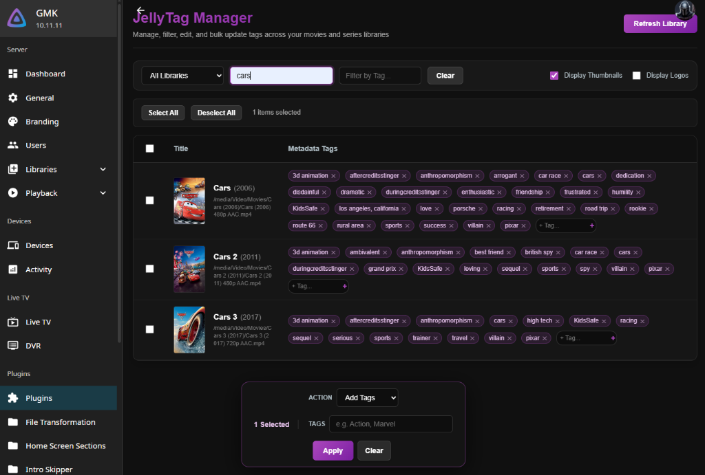
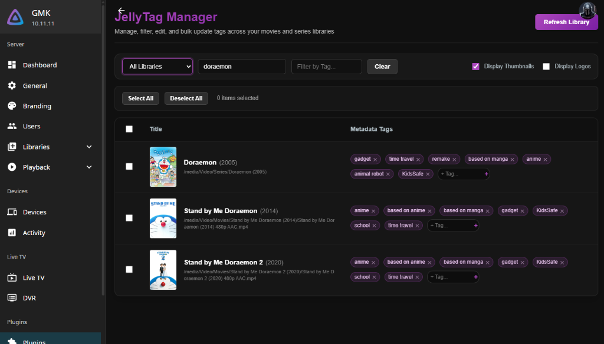
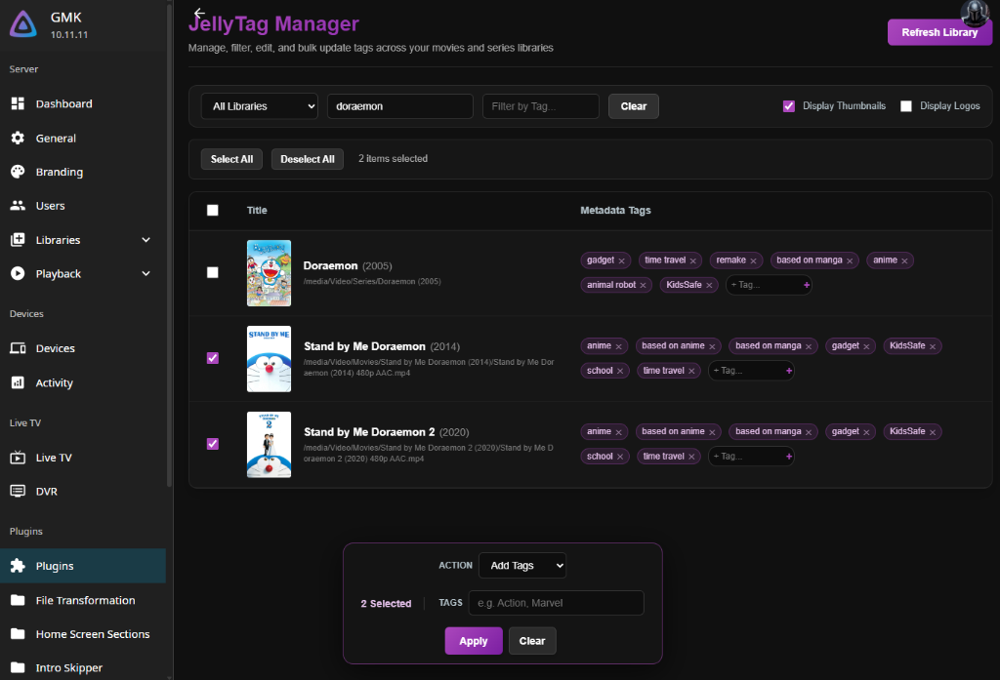
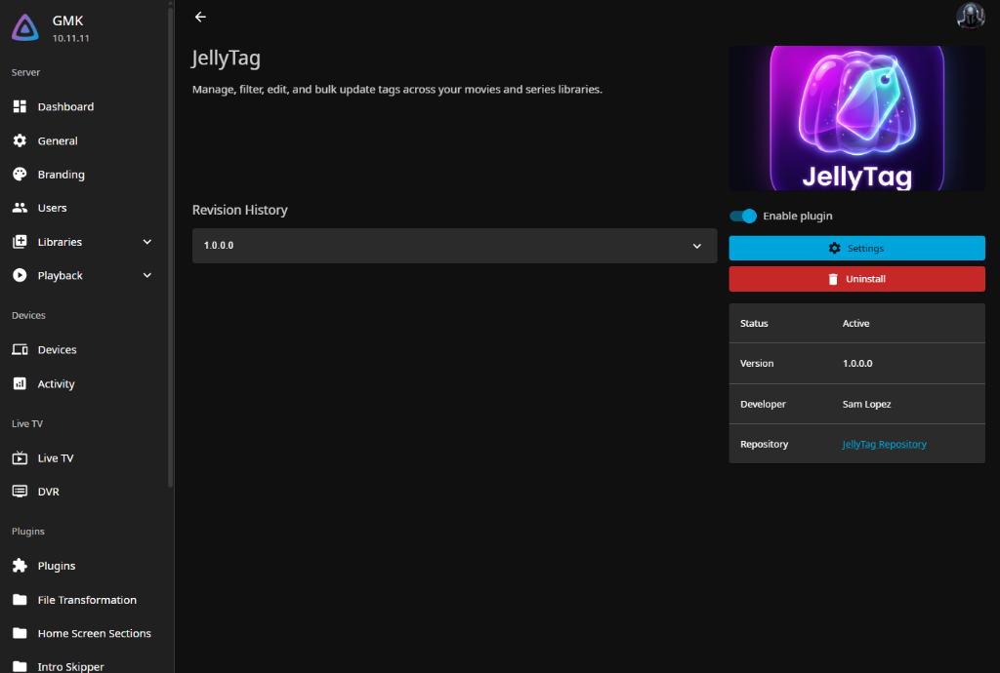
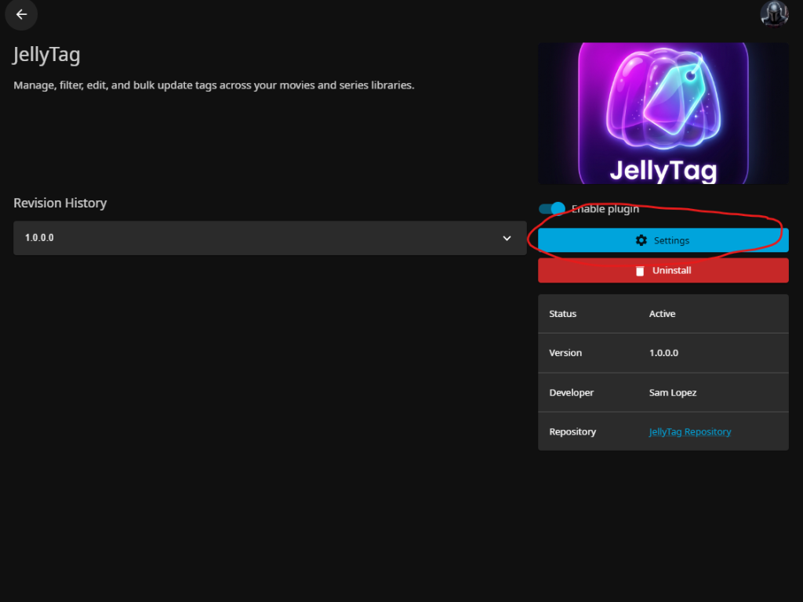
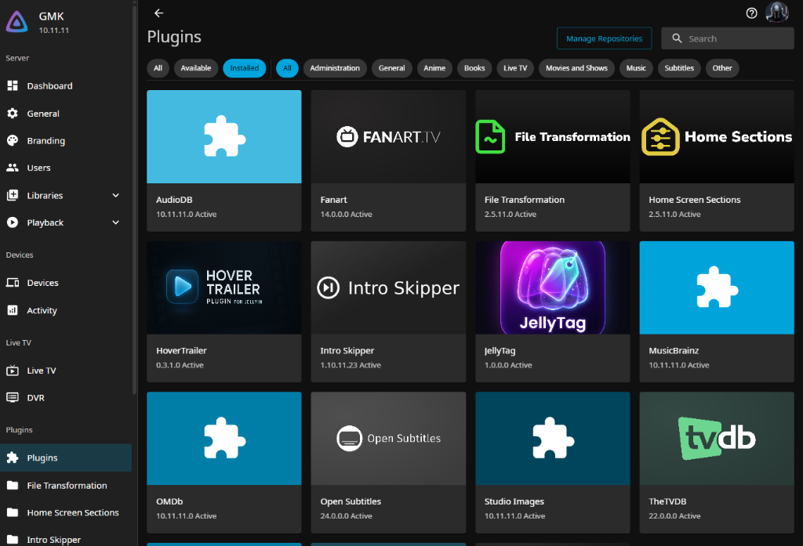
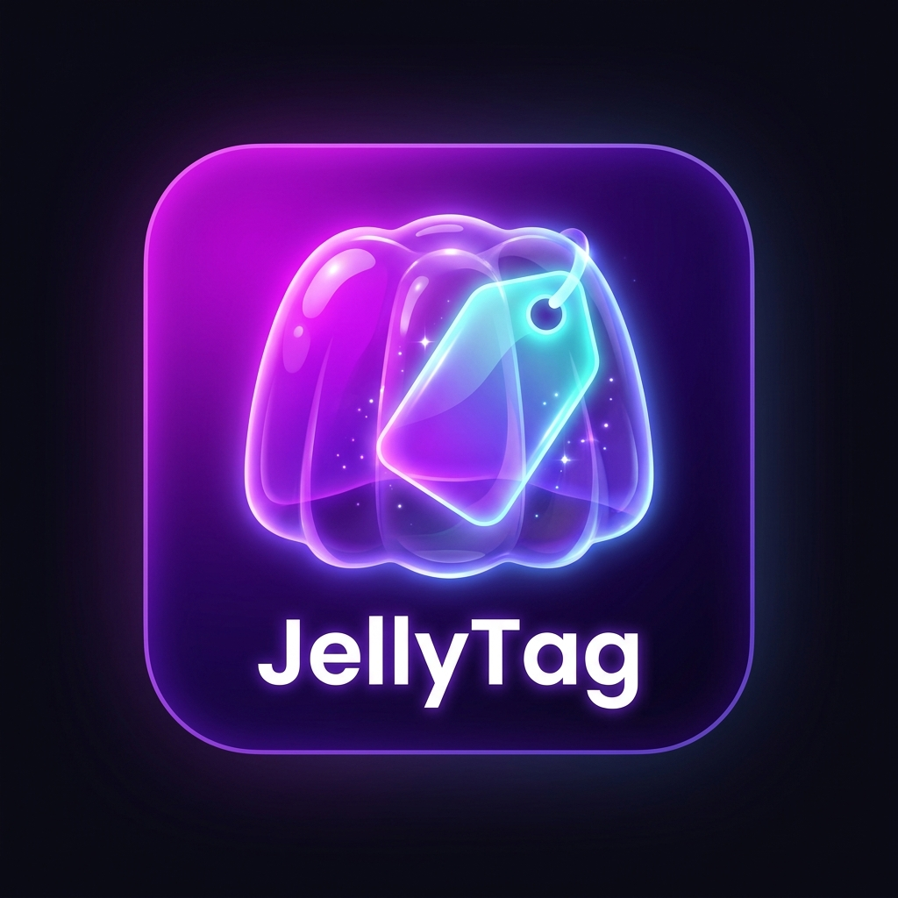

# JellyTag — Jellyfin Tagmanager Plugin

JellyTag is an administrative plugin for Jellyfin that allows you to manage metadata tags for movies and series/shows across your libraries individually and in bulk. It adds an interactive, ultra-compact, and user-friendly interface to the Jellyfin Administrator Dashboard, making library categorization, grouping, and cleanup extremely quick and efficient.

## Features

- **Dynamic Filtering:** Search for media by name, filter by specific tags, or target a single media library folder.
- **Inline Editing:** Add and remove tags directly from the movie/series list with simple, single-click controls and inline text input.
- **Bulk Operations:** Select multiple items to add, remove, or completely reset tags in a single action.
- **Secured API:** Implements administrative-only routing via ASP.NET Core policies, preventing unauthorized metadata changes.
- **Responsive Theme:** A custom dark-mode design integrated into the native Jellyfin dashboard with a clean visual grid and smooth micro-animations.

---

## Screenshots

### 1. Compact Dashboard Filters & Tag Operations


### 2. TV Show & Series Library Query Support


### 3. Floating Glassmorphic Bulk Action Toolbar


### 4. Active Plugin Details & Branding


### 5. Accessing the Tagmanager dashboard
To access the Tagmanager dashboard, open the installed **JellyTag** plugin details and click the **Settings** button.


### 6. Plugin Catalog View


---

## Compatibility

JellyTag targets **.NET 8** (`net8.0`), ensuring compatibility with:
- **Jellyfin 10.9.x** (runs on .NET 8)
- **Jellyfin 10.10.x** (runs on .NET 8)
- **Jellyfin 10.11.x and newer** (runs on .NET 9, which loads and runs .NET 8 assemblies out of the box)

---

## Installation

You can install JellyTag either automatically through the Plugin Catalog or manually by compiling the DLL.

### Method 1: Plugin Catalog (Recommended)
This method allows you to install and update the plugin with a single click directly from the Jellyfin dashboard.

1. Open your Jellyfin server and navigate to **Dashboard > Plugins**.
2. Select the **Repositories** tab.
3. Click the **+** button to add a new repository:
   - **Repository Name:** `JellyTag Repository`
   - **Repository URL:** `https://raw.githubusercontent.com/samz3/JellyTag/main/manifest.json`
4. Click **Save**.
5. Select the **Catalog** tab. Scroll down or search for **JellyTag**.
6. Select **JellyTag**, choose version `1.0.0.0`, and click **Install**.
7. Restart your Jellyfin server.
8. Go to **Dashboard > Plugins > Installed**, select **JellyTag**, and click the **Settings** button to open the dashboard.

### Method 2: Manual Installation
1. Compile the plugin from source or download the compiled `JellyTag.dll` release.
2. Navigate to your Jellyfin Server data directory:
   - **Windows (Service):** `C:\ProgramData\Jellyfin\Server\plugins\`
   - **Windows (Portable):** `[YourJellyfinFolder]\plugins\`
   - **Linux / Docker:** `/config/plugins/` (or your mapped volume path)
3. Create a folder named `JellyTag` inside the `plugins` directory.
4. Copy the `JellyTag.dll` and `thumb.png` files into the `JellyTag` directory:
   ```text
   plugins/
   └── JellyTag/
       ├── JellyTag.dll
       └── thumb.png
   ```
5. Restart your Jellyfin server.
6. Go to **Dashboard > Plugins > Installed**, select **JellyTag**, and click the **Settings** button to open the dashboard.

---

## Build Instructions

To compile the plugin from source, ensure you have the [.NET SDK 8.0](https://dotnet.microsoft.com/download/dotnet/8.0) or newer installed.

1. Open your terminal in the repository root directory.
2. Run the dotnet build command:
   ```powershell
   dotnet build -c Release
   ```
3. The compiled plugin file `JellyTag.dll` will be generated in `bin/Release/net8.0/JellyTag.dll`.

---

## Support & Donations

If you found this plugin helpful, feel free to buy me a coffee!

[](https://ko-fi.com/samz3)

---

## Logo & Branding

<p align="center">
  
</p>
